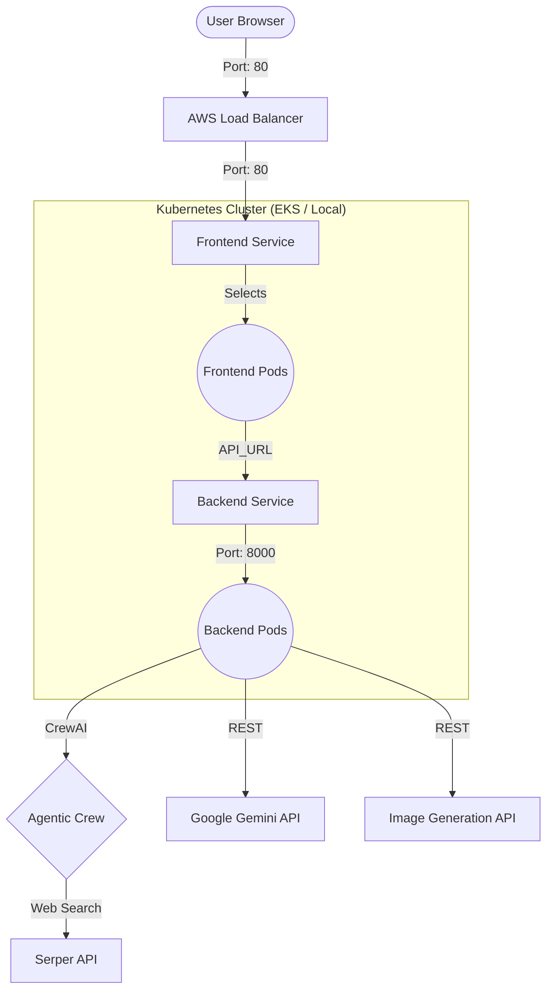

# 🎓 Lumina AI: High-Fidelity Multimodal Education Platform

[](https://kubernetes.io/)
[](https://aws.amazon.com/eks/)
[](https://fastapi.tiangolo.com/)
[](https://streamlit.io/)
[](https://ai.google.dev/)
[](https://www.crewai.com/)

**Lumina AI** is a state-of-the-art, multimodal Generative AI platform designed to transform complex topics into structured, visually-rich educational "Concept Packs." By combining autonomous **Multi-Agent Research** with high-fidelity image generation and **DevOps** excellence, it provides a premium learning experience for students and professionals alike.

---

## ✨ Core Features

*   **🕵️ Agentic Research Workflow**: Utilizes a collaborative crew of AI agents (Researcher & Writer) powered by **CrewAI** for deep, real-time web research and scraping.
*   **⚡ Multimodal Learning**: Pairs structured narrative content with high-fidelity diagrams and educational visuals.
*   **🎯 Grade-Level Personalization**: Dynamically adjusts content complexity for **Elementary**, **High School**, **College**, and **Professional** levels.
*   **💎 Premium Design System**: A stunning, modern interface featuring **Glassmorphism**, dark mode optimization, and ultra-smooth animations.
*   **🚀 Production-Ready DevOps**: Fully containerized and optimized for **Kubernetes** (local & AWS EKS) with CI/CD integration.

---

## 🏗️ Technical Architecture

The platform follows a decoupled, microservices-ready architecture for maximum scalability.



---

## 🛠️ Infrastructure & DevOps Excellence

### 🐳 Optimized Containerization
Strategic optimizations reduced our container footprint from **9GB** to just **1.16GB**:
*   **CPU-Only Builds**: Removed 5GB+ of redundant CUDA libraries.
*   **Multi-Stage Dockerfiles**: Separate builds for frontend and backend to minimize bloat.
*   **Native REST Integration**: Direct API calls to Gemini eliminate the need for heavy SDK dependencies.

### ☸️ Kubernetes Orchestration
*   **Local (Kind/Docker Desktop)**: Optimized manifests with `NodePort` mapping and local secret management.
*   **Cloud (Amazon EKS)**: Managed node groups on `t3.micro` instances with custom health probes and `LoadBalancer` services.
*   **CI/CD Pipeline**: Integrated `Jenkinsfile` and GitHub Actions for automated building and deployment.

---

## 🚀 Getting Started

### 1. Environment Configuration
Create a `.env` file in the root directory:
```ini
GEMINI_API_KEY=your_key
SERPER_API_KEY=your_key
LLM_MODEL=gemini-1.5-flash
IMAGE_API_KEY=your_key
IMAGE_BASE_URL=https://api.infip.pro/v1
```

### 2. Local Deployment (Streamlit + FastAPI)
```bash
# Terminal 1: Backend
python -m backend.main

# Terminal 2: Frontend
streamlit run frontend/app.py
```

### 3. Kubernetes Deployment
```bash
# Apply all manifests
kubectl apply -f k8s/secrets.yaml
kubectl apply -f k8s/

# Access via port-forward
kubectl port-forward service/frontend-service 8501:80
```

---

## 📂 Project Structure
*   `backend/`: FastAPI server, LLM services, and Agentic Research (CrewAI).
*   `frontend/`: Premium Streamlit interface with custom CSS/JS injection.
*   `k8s/`: Kubernetes manifests for production-grade orchestration.
*   `utils/`: Advanced prompt engineering and shared utilities.
*   `scripts/`: Automation for AWS EKS deployment and setup.

---

Designed and built for **Project - II: Multimodal GenAI Education**. 🎓✨
